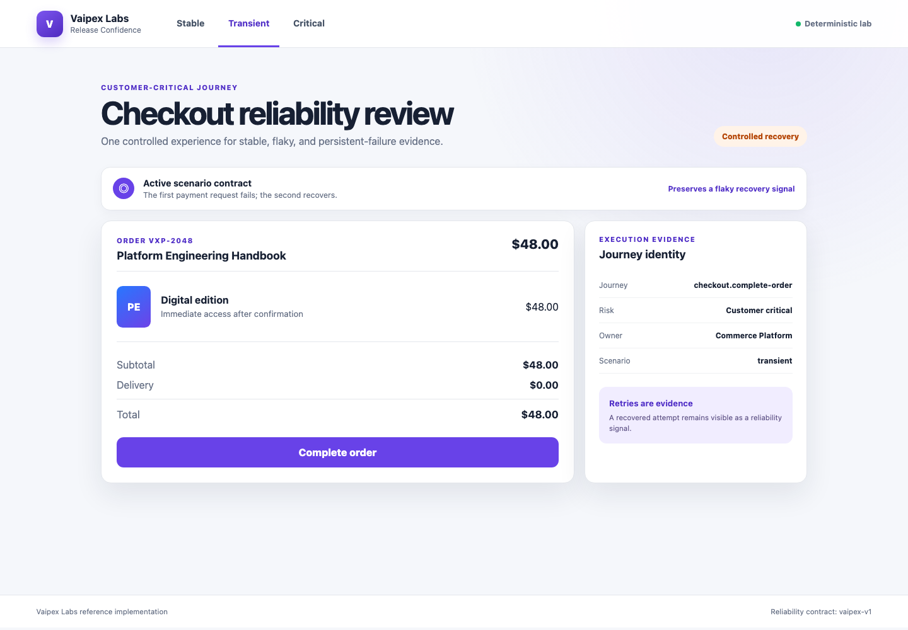
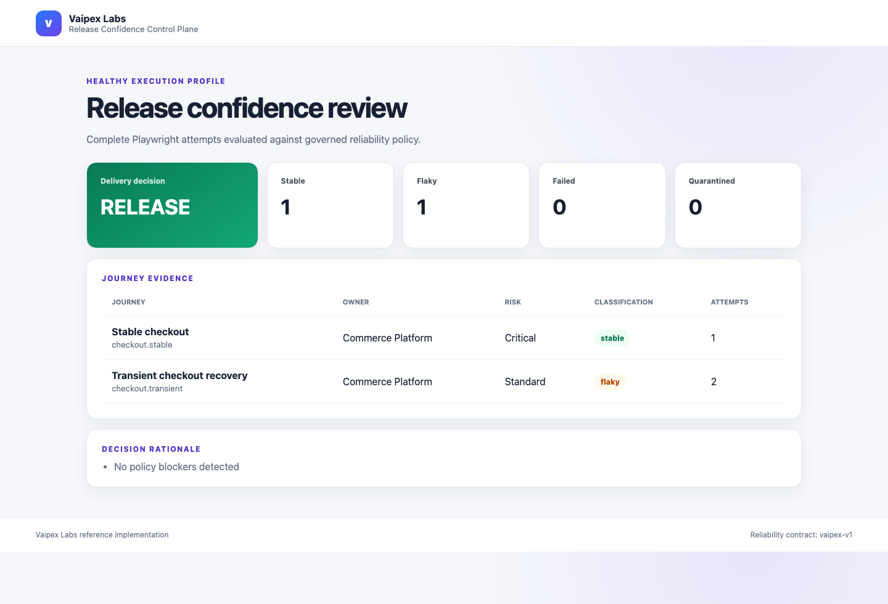

# Vaipex Test Reliability & Release Confidence Control Plane

An open reference implementation that turns complete Playwright execution
evidence into one explainable, policy-driven software release decision.

Developed by **Vaipex Labs** for the developer, test automation, quality
engineering, and platform engineering communities.


[Two-Minute Demo](#two-minute-demo) ·
[What It Delivers](#what-it-delivers) ·
[Delivery Flow](#delivery-flow) ·
[Architecture](#architecture) ·
[How It Works](#how-it-works) ·
[Policy](#release-confidence-policy) ·
[CI](#continuous-enforcement) ·
[Series](#playwright-engineering-series)

## Why This Exists

A green test run does not always mean a release is safe. A retry can conceal an
intermittent failure, a quarantine can become permanent, parallel jobs can
fragment evidence, and an aggregate pass rate can hide failure in a
customer-critical journey.

This control plane separates browser execution from release governance. It
preserves every attempt, classifies reliability, validates temporary
exceptions, correlates parallel evidence, and applies a versioned confidence
contract before returning `RELEASE` or `HOLD`.

## Two-Minute Demo

### Prerequisites

- macOS or Linux
- Python 3.12
- Internet access for the first toolchain installation

Set up the pinned environment once:

```bash
./scripts/setup.sh
```

Run the complete demonstration:

```bash
./scripts/two-minute-demo.sh
```

The command performs five visible steps:

1. Validates the pinned Python, Pytest, and Playwright toolchain.
2. Tests classification, correlation, quarantine, and decision policy.
3. Executes the healthy profile across two deterministic shards.
4. Correlates one stable and one flaky journey and proves `RELEASE`.
5. Injects a persistent critical failure and proves `HOLD` with blockers.

Review the generated evidence:

```bash
open reports/healthy-release.html
open reports/incident-hold.html
```

The same control-plane commands run locally and in GitHub Actions.

## What It Delivers

- Complete ordered attempt evidence instead of final-result-only reporting
- Explicit `stable`, `flaky`, `failed`, and `quarantined` classifications
- Deterministic stable, transient-recovery, and critical-failure scenarios
- Lossless evidence correlation across independently executed shards
- Owned, justified, issue-linked, time-bounded quarantine governance
- Critical-journey enforcement independent of aggregate success rates
- Versioned completion, flake, failure, and quarantine thresholds
- Machine-readable JSON decisions and portable HTML review dashboards
- A continuously enforced GitHub Actions release-confidence gate
- Retained CI evidence for audit, diagnosis, and release review

| Tool | Role |
| --- | --- |
| Python 3.12 | Control-plane and policy orchestration |
| Playwright for Python | Browser journey execution and screenshots |
| Pytest | Journey and policy verification |
| FastAPI | Deterministic reference application |
| JSON | Portable attempt, policy, quarantine, and decision contracts |
| HTML | Human-readable release-confidence dashboard |
| GitHub Actions | Parallel execution, correlation, and enforcement |

## Delivery Flow

Test intent moves through controlled execution, reliability classification,
governed exception handling, correlated evidence, and one transparent release
decision. The decision feeds reliability improvement back to engineering teams.


## Architecture

Developers and GitHub Actions invoke the same Python control layer. Playwright
executes reusable journeys, the reliability engines classify attempts and
correlate shards, and the governance layer evaluates exceptions and release
policy before publishing the decision and its evidence.


## How It Works

### 1. Execute deterministic journeys

The included checkout application exposes three controlled scenarios:

| Scenario | URL | Result |
| --- | --- | --- |
| Stable | `/?scenario=stable` | Passes on the first attempt |
| Transient | `/?scenario=transient` | Fails once, then recovers |
| Critical failure | `/?scenario=critical-failure` | Fails every allowed attempt |

Start the application with `./scripts/start-app.sh`, then open
[http://127.0.0.1:8000](http://127.0.0.1:8000). Use `Control-C` to stop it.



Run the reusable browser journeys headlessly or watch Chromium execute them:

```bash
./scripts/test-e2e.sh
./scripts/test-e2e.sh --headed
```

### 2. Preserve and classify attempts

| Attempt history | Classification |
| --- | --- |
| First attempt passes | Stable |
| First attempt fails; retry passes | Flaky |
| Every allowed attempt fails | Failed |
| Flaky or failed journey has an approved exception | Quarantined |

Retries are evidence, not a way to turn instability green. Each attempt keeps
its status, duration, response detail, and screenshot path.

### 3. Correlate parallel evidence

`run-reliability-shard.sh` deterministically partitions the journey catalog.
The merge command requires every expected shard, rejects duplicate journey
identities, and produces one ordered evidence document. Missing or incompatible
shards fail before policy evaluation.

### 4. Govern temporary exceptions

The quarantine register accepts only exact known journey IDs. Every exception
must include an owner, reason, HTTPS issue URL, and expiration date. Broad,
duplicate, incomplete, or expired entries fail validation. Critical journeys
cannot be quarantined under the default policy.

See [policies/README.md](policies/README.md) for the contract.

### 5. Decide and explain

The decision engine evaluates correlated evidence against the versioned policy
and emits:

- `reports/*-decision.json` for automation and downstream systems
- `reports/*.html` for human review
- process exit status for delivery enforcement



## Release Confidence Policy

The default contract in
[`policies/release-confidence.json`](policies/release-confidence.json) requires:

- 100% journey completion
- zero failed journeys
- a flake rate no greater than 50% in this deliberately small demonstration
- no more than one active quarantine
- every critical journey to pass
- no critical-journey quarantine

These demonstration thresholds are explicit and replaceable. A production team
can tighten them and expand the journey catalog without changing the evidence
or decision model.

## Continuous Enforcement

The `Release confidence gate` workflow runs on pull requests, pushes to `main`,
and manual dispatch. It:

1. validates the locked toolchain and all unit and browser tests;
2. executes the healthy journey catalog across two matrix shards;
3. uploads each shard's evidence independently;
4. downloads and correlates the complete evidence set;
5. enforces the release policy; and
6. retains the JSON and HTML evidence for 14 days.

A failed critical journey, incomplete shard set, invalid quarantine, or breached
threshold prevents the gate from reporting release confidence.

## Repository Map

```text
.github/workflows/     Parallel CI execution and release-policy enforcement
docs/images/           Vaipex flow, architecture, app, and dashboard visuals
policies/              Versioned thresholds and quarantine register
scripts/               Supported setup, execution, and demo commands
src/                   Reference application and control-plane implementation
tests/                  Browser journeys, policy tests, and contract tests
```

## Customize It

- Replace the sample checkout journeys while preserving stable journey IDs.
- Add ownership and risk metadata to the journey catalog.
- Tune thresholds in `policies/release-confidence.json`.
- Add narrow temporary exceptions to `policies/quarantines.json`.
- Forward decision JSON to a deployment, change-management, or evidence system.
- Replace the included app with any target reachable by Playwright.

## Playwright Engineering Series

This is Part 4 of the Vaipex Labs Playwright Engineering Series:

1. [Enterprise Test Automation Foundation](https://github.com/vaipexlabs/playwright-lab-01-enterprise-test-automation-foundation)
2. [Cross-Browser Quality Control Plane](https://github.com/vaipexlabs/playwright-lab-02-cross-browser-quality-control-plane)
3. [Visual & Accessibility Quality Control Plane](https://github.com/vaipexlabs/playwright-lab-03-visual-accessibility-quality-control-plane)
4. **Test Reliability & Release Confidence Control Plane**

Together, the series progresses from reusable automation foundations to
compatibility governance, experience-quality controls, and operational release
confidence.

## Project Boundaries

This project demonstrates test reliability governance. It does not replace
production observability, incident management, exploratory testing, or product
risk ownership. It provides a transparent engineering signal for safer, more
explainable automated delivery decisions.

## Contributing

Community contributions are welcome. Keep execution evidence complete,
reliability policy explicit, quarantines temporary, and decisions explainable.

Licensed under the [Apache License 2.0](LICENSE).
