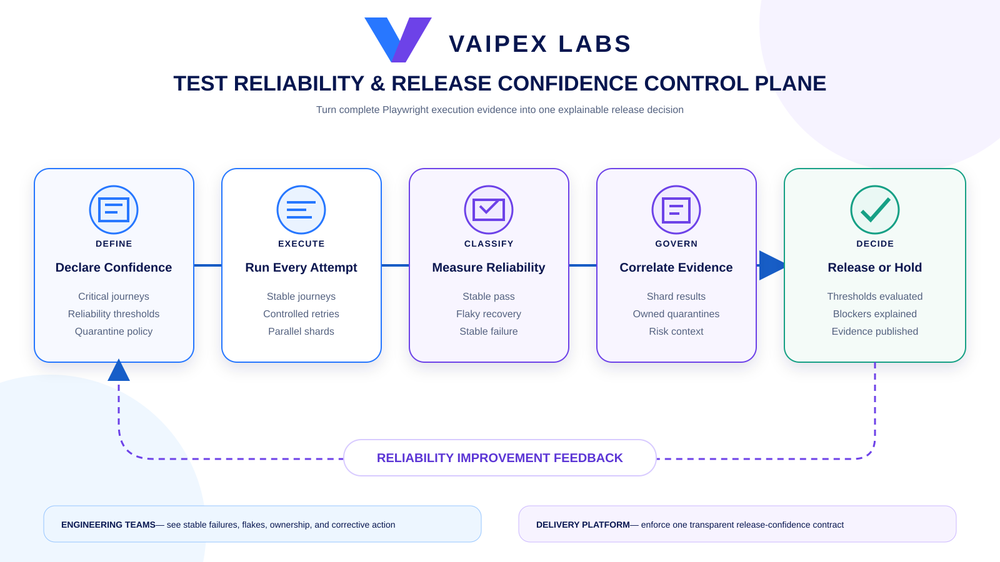
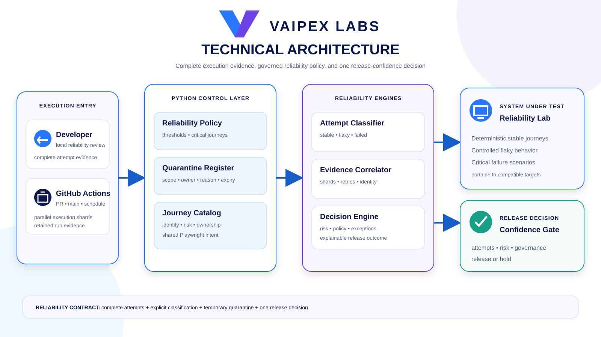

# Vaipex Test Reliability & Release Confidence Control Plane

An open reference implementation for converting Playwright execution evidence
into an intentional, policy-driven software release decision.

Developed by **Vaipex Labs** for the developer, test automation, and platform
engineering communities.


[Project Intent](#project-intent) ·
[What It Will Prove](#what-it-will-prove) ·
[Delivery Flow](#delivery-flow) ·
[Architecture](#architecture) ·
[Reliability Contract](#reliability-contract) ·
[Delivery Roadmap](#delivery-roadmap) ·
[Series Context](#series-context)

## Project Intent

A green test run does not always mean a release is safe. Retries can conceal
intermittent failures, quarantines can become permanent, parallel execution can
fragment evidence, and a simple pass percentage can hide failure in a
customer-critical journey.

This project demonstrates a test reliability control plane that separates
execution mechanics from release policy. It will collect Playwright results,
classify stable failures and flakes, govern temporary quarantine, correlate
parallel evidence, and publish one explainable `RELEASE` or `HOLD` decision.

## What It Will Prove

- First-attempt outcomes and retry outcomes are preserved separately.
- A test that passes only after retry is classified as flaky, not simply green.
- Repeated execution produces measurable pass-rate and flake-rate evidence.
- Quarantines require an owner, reason, scope, and expiration date.
- Expired, broad, or unowned quarantines fail policy validation.
- Sharded jobs publish evidence that can be merged without losing test identity.
- Customer-critical journeys can block release independently of aggregate rate.
- Versioned reliability thresholds produce one explainable release decision.
- Local execution and GitHub Actions use the same policy and reporting commands.

## Delivery Flow

Test intent moves through controlled execution, reliability classification,
governed exception handling, correlated evidence, and one release decision.



## Architecture

Developers and GitHub Actions invoke the same Python control layer. Playwright
executes reusable journeys, the reliability engine classifies attempts and
flakes, the governance layer evaluates quarantine and release policy, and the
evidence layer publishes one decision with its supporting context.



## Reliability Contract

| Signal | Control-plane interpretation |
| --- | --- |
| Passed on first attempt | Stable pass |
| Failed, then passed on retry | Flaky result requiring visibility |
| Failed on every allowed attempt | Stable failure |
| Quarantined and within policy | Visible temporary exception |
| Missing owner or expired quarantine | Governance failure |
| Critical journey failure | Release blocker |
| Threshold breach | Release blocker with policy evidence |

The control plane will not treat retries as a mechanism for hiding instability.
Every attempt remains evidence, and release policy consumes the classification
rather than only the final Pytest exit code.

## Target Experience

The finished repository will expose one short demonstration:

```bash
./scripts/two-minute-demo.sh
```

The demo will run stable and intentionally unreliable journeys, correlate
their attempts, apply quarantine and release policy, generate a reviewable
report, and print the resulting `RELEASE` or `HOLD` decision.

## Delivery Roadmap

- [x] Establish the repository, intent, licensing, roadmap, and Vaipex diagrams.
- [ ] Add the locked Python and Playwright reliability toolchain.
- [ ] Deliver a deterministic reference application and reusable journeys.
- [ ] Capture attempts and classify stable, flaky, and failed outcomes.
- [ ] Add owned, justified, scoped, and expiring quarantine governance.
- [ ] Add sharded execution and lossless evidence correlation.
- [ ] Enforce critical-journey and reliability-threshold release policy.
- [ ] Publish continuous GitHub Actions enforcement and retained evidence.
- [ ] Deliver the two-minute demo and final community-facing documentation.

Each milestone will remain independently reviewable and preserve a usable
project state.

## Planned Toolchain

| Tool | Role |
| --- | --- |
| Python 3.12 | Reliability analysis and policy orchestration |
| Playwright for Python | Browser journey execution |
| Pytest | Test identity, parametrization, markers, and assertions |
| JSON evidence | Portable attempt, quarantine, and decision contracts |
| HTML reporting | Human-readable release-confidence evidence |
| GitHub Actions | Sharded execution and continuous enforcement |

## Planned Repository Structure

```text
.github/workflows/     Continuous execution and release-policy enforcement
docs/images/           Vaipex flow and architecture illustrations
policies/              Reliability thresholds and quarantine register
scripts/               Supported setup, execution, and demo commands
src/                   Reference application and control-plane logic
tests/                  Playwright journeys and policy tests
```

## Series Context

This is Part 4 of the Vaipex Labs Playwright Engineering Series:

1. [Enterprise Test Automation Foundation](https://github.com/vaipexlabs/playwright-lab-01-enterprise-test-automation-foundation)
2. [Cross-Browser Quality Control Plane](https://github.com/vaipexlabs/playwright-lab-02-cross-browser-quality-control-plane)
3. [Visual & Accessibility Quality Control Plane](https://github.com/vaipexlabs/playwright-lab-03-visual-accessibility-quality-control-plane)
4. **Test Reliability & Release Confidence Control Plane**

Together, the series progresses from reusable automation foundations to
compatibility governance, experience-quality controls, and operational release
confidence.

## Project Boundaries

This project demonstrates test reliability governance. It does not replace
production observability, incident management, exploratory testing, or product
risk ownership. Its purpose is to provide a transparent engineering signal
that makes automated release decisions safer and more explainable.

## Contributing

Community contributions are welcome. Keep execution evidence complete,
reliability policy explicit, quarantines temporary, and decisions explainable.

Licensed under the [Apache License 2.0](LICENSE).
